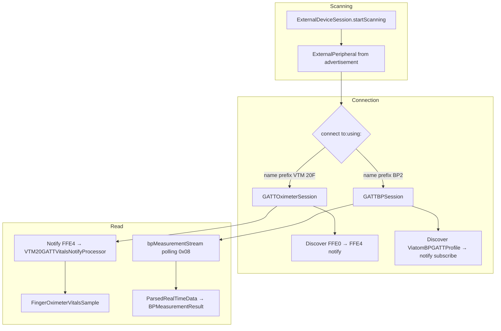

# External BLE devices — technical deep dive

This document is for someone who needs to see **where the complexity lives**, how the **two integration paths** differ, and **how data reaches the app layer** (HigoCore).

---

## 1. System layers

| Layer | Role |
|--------|------|
| **HigoCore** (`ExternalDeviceManager`) | Thin app-facing facade: `ExternalDevice`, `ExternalDeviceData`, routing by **peripheral name** (VTM 20F vs BP2). |
| **ExternalDevicesCore** | BLE logic, protocol framing, and `AsyncStream` plumbing. Most of the complexity lives here. |
| **CoreBluetooth** | Native GATT; used directly by both `GATTOximeterSession` and `GATTBPSession`. |

Core idea: **two pure-GATT paths**, each owning its own GATT profile, framing, and parsing — no third-party SDK.

---

## 2. Two connection and read paths



### 2.1. Path selection

`ExternalDeviceManager.connectToDevice` checks the peripheral name prefix:
- `VTM 20F` → `GATTOximeterSession`
- `BP2` → `GATTBPSession`
- Everything else → throws `unsupportedDeviceType` (the `ExternalPeripheral` filter already limits discovery to these two prefixes)

---

## 3. `ExternalDeviceSession` — module hub

Main file: `ExternalDevicesCore/.../ExternalDeviceSession.swift`.

### 3.1. Scanning

- Sets `ble.delegate = self` and calls `startScan()`.
- Result is **`AsyncStream<ExternalPeripheral>`**: each discovery goes through `didDiscoverDevice` → `scanContinuation?.yield`.
- **`stopScanning()`** finishes the continuation and clears `knownDevices` — important when re-entering the scan UI.

### 3.2. Connection — two phases

`connect(to:using:)` runs **in order**:

1. **CoreBluetooth phase** — `connectionWaiter` + `ble.connectToDevice`. Success is signaled by delegate `didConnectedDevice` → `connectionWaiter.succeed()`. Wrapped in **`AsyncTimeout`** (~12 s); on timeout the connection is cancelled.
2. **Post-connect phase** — `await handler.onPeripheralConnected(rawPeripheral)`. This **differs** by device:
   - **VTM 20F**: `GATTOximeterSession` sets itself as `CBPeripheralDelegate`, discovers service **FFE0**, characteristic **FFE4**, enables **notify**; the connect continuation completes in `didUpdateNotificationStateFor`.
   - **BP2**: `GATTBPSession` sets itself as `CBPeripheralDelegate`, discovers the Viatom service and write/notify characteristics, enables notify; the connect continuation completes in `didUpdateNotificationStateFor`.

If phase 2 fails, the connection is treated as failed even though "BLE is connected" — the app should surface that as a path/setup error.

### 3.3. Polling streams

Both `GATTBPSession.bpMeasurementStream()` use **`ExternalDevicePollingStream.repeating`**: loop on an interval (~200 ms), send a command (cmd `0x08`), `yield` the response, until measurement end or cancellation.

Code: `ExternalDeviceSessionSupport.swift` (`AsyncTimeout`, `ExternalDevicePollingStream`).

---

## 4. Blood pressure — `GATTBPSession` and `ViatomBPRealTimeDataParser`

Files (grouped by subdirectory):

- `BloodPressure/GATTBPSession/GATTBPSession.swift`, `BloodPressure/GATTBPSession/GATTBPSession+CBPeripheralDelegate.swift`
- `BloodPressure/ViatomBPGATTProfile/ViatomBPGATTProfile.swift` (UUIDs), `ViatomBPCommand.swift`, `ViatomBPResponse.swift`, `ViatomBPFrameCodec.swift`
- `BloodPressure/ViatomBPRealTimeDataParser/ViatomBPRealTimeDataParser.swift`

### 4.1. Protocol framing (`ViatomBPFrameCodec`)

Every command is wrapped in a Viatom frame:

```
[0xA5][CMD][~CMD][Pkg.Type][Pkg.No.][Len H][Len L][Data...][CRC8]
```

- Header `0xA5`, command byte, its bitwise complement, package type `0x00` (request) / `0x01` (response), incrementing package number, **little-endian** 16-bit payload length, payload bytes, CRC8 (`poly = 0x07`, `init = 0x00`).
- `ViatomBPFrameCodec.buildRequestFrame` encodes; `parseResponse` reassembles partial notify chunks and decodes.

### 4.2. Command flow

- **Start measurement** (cmd `0x09`, data byte `0x00`) — sent once to begin the cuff inflation cycle.
- **Get real-time data** (cmd `0x08`) — polled at ~200 ms; response payload is `RealTimeData` (see §4.3).
- **Browse records** (same cmd `0x09`, `Target_status` byte `0x02`) — defined in the Viatom protocol and as ``ViatomBPTargetStatus/browseRecords`` in `ExternalDevicesCore` for low-level / future use. **HigoCore** does not expose this on the public ``BP2DeviceCommand`` API until on-device file listing and transfer are implemented; host apps should not rely on it from the SDK today.
- Packet reassembly: incoming notify bytes accumulate in a `receiveBuffer`; `parseResponse` returns `.complete` once a full framed response arrives.
- `sendCommand` uses a `CheckedContinuation` (protected by `NSLock`) and `AsyncTimeout` to convert the callback-style response into `async/await`.

### 4.3. `RealTimeData` layout

```
RealTimeData {
    RunStatus   run_status;    // 9 bytes (status + BatteryInfo[4] + reserved[4])
    RealTimeWaveform rt_wav;   // type byte + Data + Waveform
}
```

`ViatomBPRealTimeDataParser` decodes:
- **`run_status.status`** → `ExternalPeripheralRunStatus`.
- **`rt_wav.type = 0x01`** (measure end) + remaining bytes → `BPMeasurementResult` (SYS, DIA, MAP, pulse, state code, medical result).
- **`rt_wav.type = 0x00`** (measuring) → only status and battery, no BP values.

### 4.4. HigoCore

`ExternalDeviceManager.mapGATTBPToDeviceData` drives the cycle: start → poll stream → `ExternalDeviceRealtimeDataParser.mapBloodPressure(from:)` → yield `ExternalDeviceData` → stop on `isMeasurementComplete`.

---

## 5. VTM 20F — raw GATT (`GATTOximeterSession`)

File: `FingerOximeter/GATTOximeterSession.swift`.

### 5.1. Responsibilities in one class

This type is simultaneously:

- **`ExternalDevicePostConnectHandler`** — post-`connect` setup,
- **`FingerOximeterVitalsSource`** — producer of `AsyncStream<FingerOximeterVitalsSample>`,
- **`CBPeripheralDelegate`** — must be the single delegate for the session (CoreBluetooth expects consistent callback handling).

### 5.2. Delegate sequence

1. `didDiscoverServices` → find **FFE0**, `discoverCharacteristics` for **FFE4**.
2. `didDiscoverCharacteristicsFor` → store the characteristic, `setNotifyValue(true)`.
3. `didUpdateNotificationStateFor` → on success → **resume** the continuation from `onPeripheralConnected` (connection "ready" for upper layers).
4. `didUpdateValueFor` → FFE4 only, `processor.processNotifyPayload(data)` → `yield` on `streamContinuation`.

### 5.3. Stream lifecycle

- `fingerOximeterVitalsStream()` creates an `AsyncStream` and on **termination** calls `setNotifyValue(false)` when peripheral and characteristic are known.
- `finishStream()` — e.g. on manager disconnect — finishes the stream continuation.

---

## 6. FFE4 protocol — `VTM20FGATTVitalsCodec` and deduplication

File: `FingerOximeter/VTM20FGATTVitalsCodec.swift`.

### 6.1. Problem: one callback, multiple frames

iOS may deliver **several** `0xFE`-prefixed records in a single `didUpdateValueFor`, or **repeat** the same vitals frame. Hence:

- **`fecSegments(_:)`** splits `Data` into segments: either from `FE` to the next `FE`, or leading bytes before the first `FE` as one segment (avoids dropping bytes).
- **`VTM20GATTVitalsNotifyProcessor`** tries `FingerOximeterVitalsSample(vtm20fGATTSegment:)` per segment; **skips** a vitals frame if the **first 10 bytes** match the last accepted fingerprint. State is protected with **`NSLock`** (callbacks may arrive on different execution contexts).

### 6.2. Frame types (message type at byte index 2)

- **`0x55`** — vitals/status; the important fixed layout is **10 bytes** `FE 0A 55 …` (see `Constants` in the codec and in `FingerOximeterVitalsSample`).
- **`0x56`** — pleth / high-rate waveform; used mainly for diagnostics (`isOnlyPlethPayload`), not primary SpO₂ UI on this path.

### 6.3. `FingerOximeterVitalsSample` (GATT)

`init?(vtm20fGATTSegment:)`:

- Requires header `FE 0A 55` and at least 10 bytes; **copies** into `Data(segment)` because `Data` subsequences use indices relative to the parent buffer.
- **Validity** (`measurementValid`): e.g. flag `0x01` + `0xFF` sentinels on PR/SpO₂ → invalid; flag `0x00` + plausible ranges → valid; there is also a **lenient** branch for `0x00` outside the "strict" range (still `valid = true` — intentional; if you change behavior, re-check tests).

---

## 7. `ExternalDeviceManager` (HigoCore) — app API mapping

- **`readData()`**:
  - If `gattOximeterSession` exists → `fingerOximeterVitalsStream()` → per sample either SpO₂+PR or `measurementQuality(.invalidNoSignalOrFinger)`.
  - If `gattBPSession` exists → `startBPMeasurement()` then `bpMeasurementStream()` → `mapBloodPressure(from:)`.

---

## 8. Debug and tests

- **`Apps/ExternalDevicesBLEDebug/`** — low-level GATT debugging; shares parsing with the package (`VTM20FGATTVitalsCodec`).
- Tests: `VTM20FGATTVitalsCodecTests`, `ExternalDeviceSessionSupportTests` (polling, timeouts), `ViatomBPGATTProfileTests`, `ViatomBPFrameCodecTests`, `ViatomBPRealTimeDataParserTests`, `GATTBPSessionTests`, `BPMeasurementResultTests`.

---

## 9. Change checklist (staying sane)

1. **New device** — create a new `ExternalDevicePostConnectHandler`; add the name prefix to `ExternalDeviceManager.connectToDevice` and `ExternalPeripheral.Constants.devicePrefixes`.
2. **Name prefix changes** — routing in `ExternalDeviceManager` is **string-based** (`hasPrefix("BP2")`).
3. **VTM 20F** — any byte offset change: keep `VTM20FGATTVitalsCodec.Constants` and `FingerOximeterVitalsSample.Constants` in sync + tests.
4. **BP2 protocol changes** — update `ViatomBPGATTProfile`, `ViatomBPFrameCodec`, or `ViatomBPRealTimeDataParser` constants; re-run `ViatomBPRealTimeDataParserTests`.
5. **Streams** — remember `onTermination` / `finishStream` so notify state is not left dangling.

---

## 10. File index

| Topic | Path (under `ExternalDevicesCore/Sources/ExternalDevicesCore/`) |
|--------|------------------------------------------------------------------|
| Session, scan, connect | `ExternalDeviceSession.swift` |
| Timeout, polling helper | `ExternalDeviceSessionSupport.swift` |
| Central delegate | `ExternalDeviceSession+ExternalBluetoothCentralDelegate.swift` |
| BP GATT session | `BloodPressure/GATTBPSession/` (`GATTBPSession.swift`, `GATTBPSession+CBPeripheralDelegate.swift`) |
| BP Viatom protocol | `BloodPressure/ViatomBPGATTProfile/` (`ViatomBPGATTProfile`, `ViatomBPCommand`, `ViatomBPResponse`, `ViatomBPFrameCodec`) |
| BP parser | `BloodPressure/ViatomBPRealTimeDataParser/ViatomBPRealTimeDataParser.swift` |
| VTM 20F GATT session | `FingerOximeter/GATTOximeterSession.swift` |
| Segmentation / dedupe | `FingerOximeter/VTM20FGATTVitalsCodec.swift` |
| SpO₂ sample | `FingerOximeter/FingerOximeterVitalsSample.swift` |
| App facade | `HigoCore/.../ExternalDeviceManager/ExternalDeviceManager.swift` |

---

*Last updated: vendor SDK removed; all device communication now uses pure CoreBluetooth GATT.*
