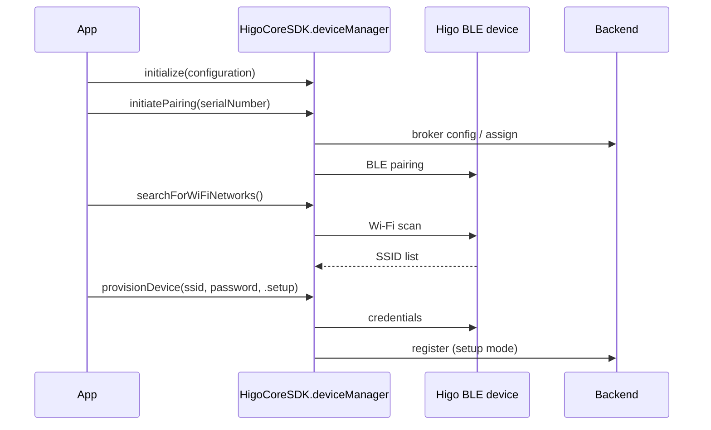

# Happy path: pair and provision Wi‑Fi

End-to-end flow for a new Higo device: initialize the SDK → pair over BLE → scan nearby networks on the device → provision credentials → complete setup.

## Flow



## Sample

Keep BLE active between steps—do not call ``DeviceManaging/disconnect()`` between pairing and provisioning unless you intentionally end the session.

```swift
import HigoCore

func onboardDevice(serialNumber: String, ssid: String, password: String) async throws {
    let deviceManager = try HigoCoreSDK.deviceManager

    let pairingResult = try await deviceManager.initiatePairing(
        serialNumber: serialNumber,
        isDeviceAssigned: false,
        isLoggingEnabled: false
    )

    switch pairingResult {
    case .paired:
        break
    case .deviceAlreadyProvisioned:
        // Device already on Wi‑Fi; skip scan/provision or use .wifiUpdate only
        return
    }

    let networks = try await deviceManager.searchForWiFiNetworks(isLoggingEnabled: true)
    guard networks.contains(where: { $0.ssid == ssid }) else {
        // Handle SSID not in list (user pick or retry scan)
        return
    }

    try await deviceManager.provisionDevice(
        serialNumber: serialNumber,
        ssid: ssid,
        password: password,
        mode: .setup
    )
}
```

## Parameters to decide in your app

| Parameter | Guidance |
|-----------|----------|
| `isDeviceAssigned` | `true` if the backend already assigned the device to the user; `false` for first-time registration |
| `isLoggingEnabled` | Enable device log upload during pairing/scan when diagnosing field issues |
| `ProvisioningMode.setup` | First-time Wi‑Fi + backend registration |
| `ProvisioningMode.wifiUpdate` | Change Wi‑Fi on an already provisioned device |

## Related guides

- [Pairing](pairing.md)
- [Wi‑Fi provisioning](wifi-provisioning.md)
- [Pairing without device Wi‑Fi scan](pairing-without-wifi-scan.md)
